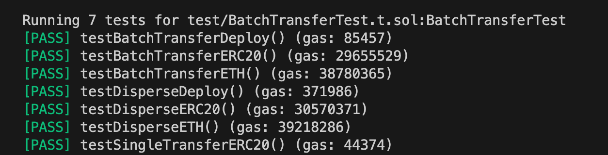

# Batch.Money

Efficiently transfer ether or tokens to many addresses in batch, powered by [Huff](https://github.com/huff-language/huff-rs) and [WTF Academy](https://wtf.academy).

## Key Features

1. Efficiently transfer ether or tokens in batch. Saves 2~3% gas compared to Disperse App.

2. Support non-standard ERC20 (i.e. [USDT](https://etherscan.io/address/0xdac17f958d2ee523a2206206994597c13d831ec7#code)).

3. Small contract size, saves ~80% gas on deployment.

## Supported Networks

website: [batch.money](https://batch.money)

| Network      | Contract address                                                                                                                                                     |
| ------------ | ----------------------------------------------------------------------------------------------------------------------------------------------------------------------------- |
| ETH       | [0xD35a289c1D5F6f6a604d6026111109694e51BA25](https://etherscan.io/address/0xD35a289c1D5F6f6a604d6026111109694e51BA25)                                               |
| Goerli       | [0xDC7a1993196d63db926c3B2e1C42682f39885B96](https://goerli.etherscan.io/address/0xdc7a1993196d63db926c3b2e1c42682f39885b96)                                               |

## Test Results

### Transfer ERC20 to 100 addresses on Goerli

To test the gas consumption fairly, we created a new tokens for different methods. For normal transfer, we record the gas used by transfering token to 1 address, and then multiply it by 100.

| type    | gas consumption | txn proof| 
| -------- | -------- | -------- | 
| Normal Transfer  | 5,212,400 | [link](https://goerli.etherscan.io/tx/0x35549e3c4e4f2116515b3f4a2496ff8d2c455d2cc1a2fce3b97b193ef838e3cd) single txn      |
| Disperse  | 2,754,920 | [link](https://goerli.etherscan.io/tx/0x9d20b73d7b102aacc63dadf01ed7767cbbfd1c3f92302b08f6741be4bd8fb6cf)      |
| BatchMoney  | 2,694,098 ✅ | [link](https://goerli.etherscan.io/tx/0xdfd94600c57f72dc54e8741c084ab2e5544556e76baa0d6413b5189a6872f35a)      |

### Transfer ERC20/ETH to 1,000 addresses in Foundry

Compared to Dipserse, BatchMoney saves ~80% on deployment and 2~3% on transfer ERC20/ETH to 1,000 addresses.



## Quick Start

1. Clone this repo or use template

```shell
git clone https://github.com/AmazingAng/BatchMoney
cd BatchMoney
```

2. Install dependencies

```shell
forge install
```

3. Build & Test

```shell
forge build
forge test
```

## Details

1. Contracts: check `src` folder.
2. Tests: check `test` folder.
3. Frontend: check `frontend` folder.
4. Runtime bytecode:
    - evm-shanghai: `0x5f3560e01c8063ae4edb2c1461001e578063a0ce91d8146100be575f5ffd5b600435602435306323b872dd5f52336020528060405281606052602060606064601c5f875af13d156060516001141716610056575f80fd5b60443560040180356064356004018035828114610071575f80fd5b600163a9059cbb5f525b8181116100bc578481602002013560205282816020020135604052602060606044601c5f8c5af13d1560605160011417166100b4575f80fd5b60010161007b565b005b600435600401803560243560040180358281146100d9575f80fd5b60015b818111610107575f80808086856020020135898660200201355af16100ff575f80fd5b6001016100dc565b00`

## Disclamer

These contracts are **unaudited** and are not recommended for use in production.

The contract is **experimental software** and is provided on an "as is" and "as available" basis.

We **do not give any warranties** and **will not be liable for any loss** incurred through any use of this codebase and product.


## Reference

1. [disperse research](https://github.com/banteg/disperse-research)
2. [disperse clone](https://github.com/rajkharvar/disperse-clone)
3. [huffmate](https://github.com/huff-language/huffmate)
4. [TxRouter](https://github.com/wangshouh/TxRouter)
